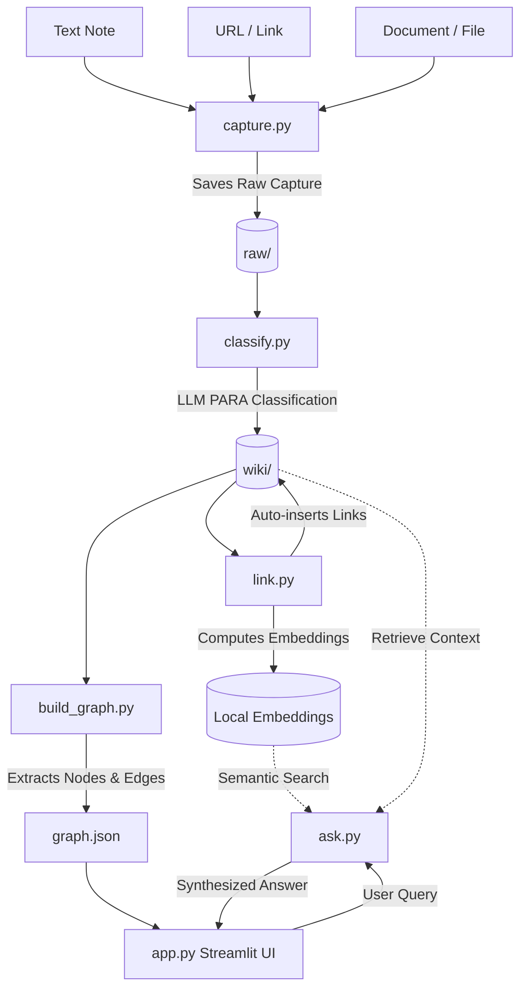

# Architecture Design: Cerebro

Cerebro is a personal AI Second Brain designed to capture, organize, link, visualize, and query personal knowledge. It uses a file-based storage design, utilizing LLMs for categorization and semantic search, sentence embeddings for automated document linking, and a force-directed graph for exploration.

---

## 1. System Overview



The system operates in five main phases:
1. **Ingestion & Capture:** A fast, one-command capture mechanism writes unorganized inputs to `raw/`.
2. **Organization & Classification:** LLM-based categorization using the PARA method to generate metadata and write to `wiki/`.
3. **Semantic Linking:** Document embeddings are used to calculate semantic similarity and automatically inject cross-links between notes.
4. **Graph Projection:** Relationships (links) and documents (notes) are modeled as a nodes-and-edges graph.
5. **Interactive Interface (UI & RAG):** A Streamlit app containing an interactive, zoomable, drag-to-explore network graph and a RAG (Retrieval-Augmented Generation) search interface.

---

## 2. Component Architecture

### 2.1 Ingestion Component (`capture.py`)
- **Responsibility:** Capture user input (notes, links, files) with minimal latency and write to `raw/`.
- **Inputs:** CLI Arguments (Text, Link, File path).
- **Processing:**
  - Generate a unique ID (based on UUID or timestamp hash).
  - Create a standardized capture structure containing:
    - Unique ID
    - Timestamp (ISO 8601)
    - Source Type (Text, Link, File)
    - Content/Payload
- **Storage:** Saves as a JSON file in `raw/` named `{timestamp}_{id}.json` to preserve raw structure.

### 2.2 Classification Component (`classify.py`)
- **Responsibility:** Move items from `raw/` to `wiki/` by classifying them using an LLM.
- **Inputs:** Files in `raw/`.
- **Processing:**
  - Read raw capture.
  - Query LLM (Groq / Llama 3) with a system prompt instructing it to extract:
    - **PARA Category:** Projects, Areas, Resources, or Archives.
    - **Tags:** Descriptive keywords.
    - **One-line Summary:** Concise title/description.
  - Parse the structured LLM response (JSON).
- **Storage:** Writes a markdown file in `wiki/` containing YAML frontmatter and the raw content.
  - Target Path: `wiki/{category}/{filename}.md`

### 2.3 Linking Component (`link.py`)
- **Responsibility:** Establish connections between notes in `wiki/` using embeddings without manual tagging.
- **Inputs:** Markdown files in `wiki/`.
- **Processing:**
  - Initialize local sentence-transformers model (e.g., `all-MiniLM-L6-v2`).
  - Calculate dense embedding vectors for note contents.
  - Perform cosine similarity comparisons between the active note and all existing notes.
  - For pairs exceeding a pre-defined threshold (e.g., `similarity > 0.6`):
    - Append Markdown links (`[[Linked Note Title]]` or `[Linked Note Title](../relative/path/to/note.md)`) to both files to create bidirectional edges.
- **Storage:** Direct inline modification of markdown files in `wiki/`. Embeddings can be persisted in a local cache (e.g., SQLite or a lightweight JSON/NPZ vector index) to avoid redundant computations.

### 2.4 Graph Data Builder (`build_graph.py`)
- **Responsibility:** Map notes and their cross-links to a graph structure.
- **Inputs:** Markdown files in `wiki/`.
- **Processing:**
  - Parse YAML frontmatter of each markdown file to create nodes.
  - Parse links (e.g., regex extraction of `[[link]]` or `[text](path)`) to create edges.
  - Construct a JSON object containing:
    - `nodes`: List of objects containing `id`, `label` (title/summary), `category` (PARA), `tags`, `summary`.
    - `edges`: List of objects containing `source`, `target` node IDs.
- **Storage:** Saves to `graph.json`.

### 2.5 RAG Search Engine (`ask.py`)
- **Responsibility:** Retrieve relevant notes and synthesize answers to user queries.
- **Inputs:** Search query string.
- **Processing:**
  - Generate embedding for user query.
  - Retrieve top-$K$ nearest-neighbor notes based on embedding similarity.
  - Read the content of the retrieved markdown files.
  - Assemble a prompt combining the user query and the retrieved note contexts.
  - Query Llama 3 via Groq API.
- **Outputs:** Markdown response containing synthesized answer and citations/sources.

### 2.6 Application Portal (`app.py`)
- **Responsibility:** Streamlit frontend displaying the interactive graph and providing the RAG chat input.
- **Sub-components:**
  - **Graph Visualizer:** Embeds a JavaScript graph library (`vis-network` or `Cytoscape.js`) via standard Streamlit HTML components (using `streamlit.components.v1.html`) or `streamlit-agraph` wrapper. Enables dragging, zooming, pulsing nodes, and showing popup content on hover.
  - **Chat Interface:** Text input for query, displaying chat history, and presenting synthesized answers.

---

## 3. Data Schema & Models

### 3.1 Raw Capture Schema (`raw/*.json`)
```json
{
  "id": "e4a2c892-74f0-4db6-9430-61f2ee729221",
  "timestamp": "2026-07-09T14:02:10Z",
  "source_type": "link",
  "source_value": "https://example.com/article",
  "raw_content": "This is the scraped or captured content of the web page..."
}
```

### 3.2 Classified Note Schema (`wiki/{category}/{filename}.md`)
```markdown
---
id: e4a2c892-74f0-4db6-9430-61f2ee729221
timestamp: 2026-07-09T14:02:10Z
title: Example Article Summary
category: Resources
tags:
  - web-dev
  - research
summary: An article detailing modern web architectural patterns.
links:
  - a1b2c3d4-e5f6-7890-abcd-ef1234567890
---

# Example Article Summary

This is the scraped or captured content of the web page...

## Related Notes
- [[a1b2c3d4-e5f6-7890-abcd-ef1234567890]] (Category: Projects)
```

### 3.3 Graph Schema (`graph.json`)
```json
{
  "nodes": [
    {
      "id": "e4a2c892-74f0-4db6-9430-61f2ee729221",
      "label": "Example Article Summary",
      "category": "Resources",
      "tags": ["web-dev", "research"],
      "summary": "An article detailing modern web architectural patterns."
    }
  ],
  "edges": [
    {
      "source": "e4a2c892-74f0-4db6-9430-61f2ee729221",
      "target": "a1b2c3d4-e5f6-7890-abcd-ef1234567890"
    }
  ]
}
```

---

## 4. Technical Stack

| Layer | Technology / Library | Reason |
|---|---|---|
| **Programming Language** | Python 3.10+ | Robust ML libraries, CLI tooling, and rapid prototyping. |
| **Embeddings Model** | `sentence-transformers/all-MiniLM-L6-v2` | Fast, local execution, free, and highly accurate for sentence/paragraph similarities. |
| **LLM Provider** | Groq (Llama 3 8B / 70B) | High speed, free tier availability, excellent structured JSON extraction. |
| **Frontend Framework** | Streamlit | Quick dashboard implementation, native python wrapper, simple component layout. |
| **Graph Visualization** | `vis-network` (via iframe or component) | Dynamic, interactive, handles force-directed physics models, zoom and drag natively. |
| **Data Storage** | Markdown / JSON flat files | Portability, version control friendly (git), readable outside the application. |

---

## 5. Security & Key Design Decisions

1. **File-System Database:** Using raw text files allows easy editing inside Markdown editors (like Obsidian or VS Code) without locking user data into a closed database database.
2. **Local Embedding Computation:** Calculating embeddings locally (`sentence-transformers`) preserves user privacy and eliminates cost/rate limits associated with commercial embedding APIs.
3. **Decoupled Job Stages:** Designing separate CLI scripts (`capture.py`, `classify.py`, `link.py`, `build_graph.py`) enables the system to be run synchronously on capture, or as background chron jobs depending on the latency budget.
4. **Structured JSON Output from Groq:** For categorization, we enforce structured JSON mode to avoid parsing errors.
